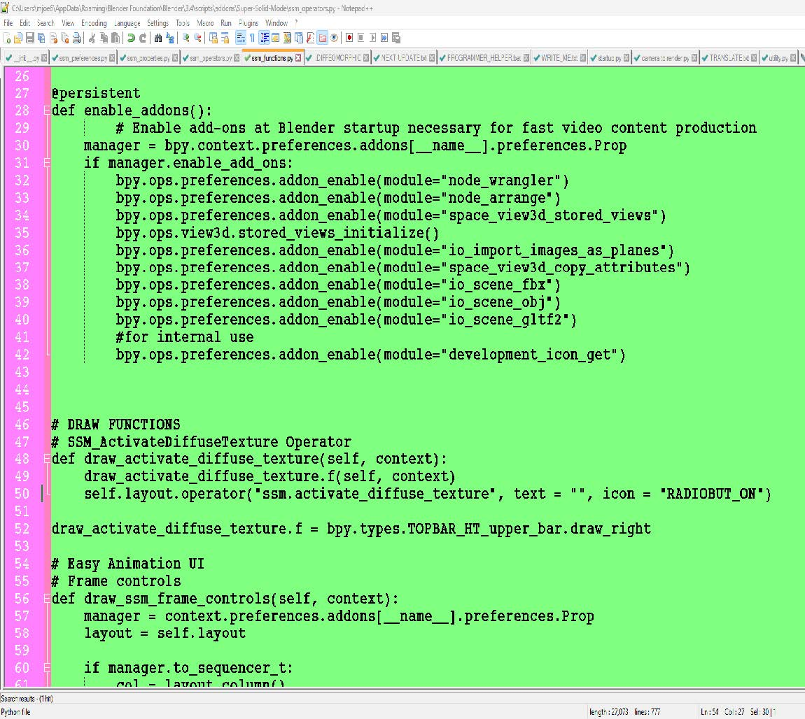
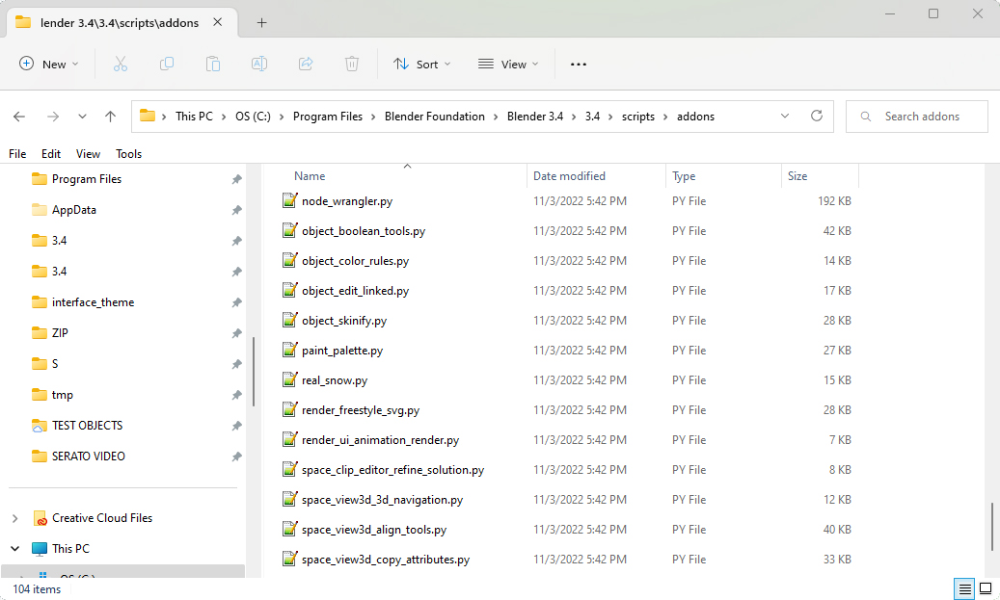

# addon enable

You can decide which default Blender
Add-ons you want enabled at startup.
This file in the Green Text Editor is
installed when you install SUPER
SOLID MODE! and is where I enable
the Add-ons in the code. SUPER
SOLID MODE! install location is: 



C:\Users\[USERNAME]\AppData\Roaming\Blender Foundation\Blender\3.4\scripts\addons
And the name of the Green file is: "_init_.py"
Go to Windows Explorer (path listed under picture) choose which
Blender default Add-on you want automatically enabled,
copy the name of the file without the .py



C:\Program Files\Blender Foundation\Blender 3.4\3.4\scripts\addons
Copy a line like this from _init_.py and paste the file name where it says [put here] below
and leave the quotes:

```python 
bpy.ops.preferences.addon_enable(module="[put here]")
```

Make sure it looks like image below, save the file and restart Blender,
now the Add-on will be automatically enabled at Blender startup.
You may have to disable and re-enable FAST ANIMATION STUDIO TOOLS!
in Add-on Preferences to see the changes take effect. If your change to
the code doesn't work for any reason, undo the changes you made in
your text editor (I recommend Notepad++) save, and restart Blender...
...you may have to disable and re-enable FAST ANIMATION STUDIO TOOLS!
in Add-on Preferences to see the changes take effect


