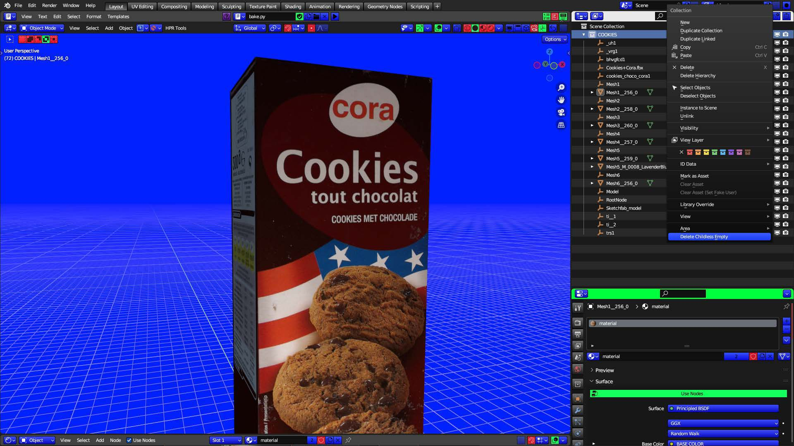

# Delete Childless Empties

When you import a GLTF file, say from Sketchfab (because that's the
best way to download a model from Sketchfab...you never have to
worry about any of the materials being there) those empties that they
put on there always seem to get in the way.
DELETE CHILDLESS EMPTIES is available when you right click a
GLTF file right after you bring it into BLENDER! when all the objects
of the GLTF are still selected, it unparents all the objects in the GLTF
and deletes all the empties for you. All you have to do then is just
join the objects or move them into a collection.(Cont...) 

(Cont...) If you have a bunch of childless empties in your scene right
click just one item, and the option is also available there, but it just
deletes all the childless empties in your whole scene, no unparenting
then, because it's not needed. 

The option is available on a collection by collection basis to delete all
childless empties in any collection without affecting the rest of your
collections.