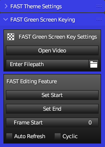
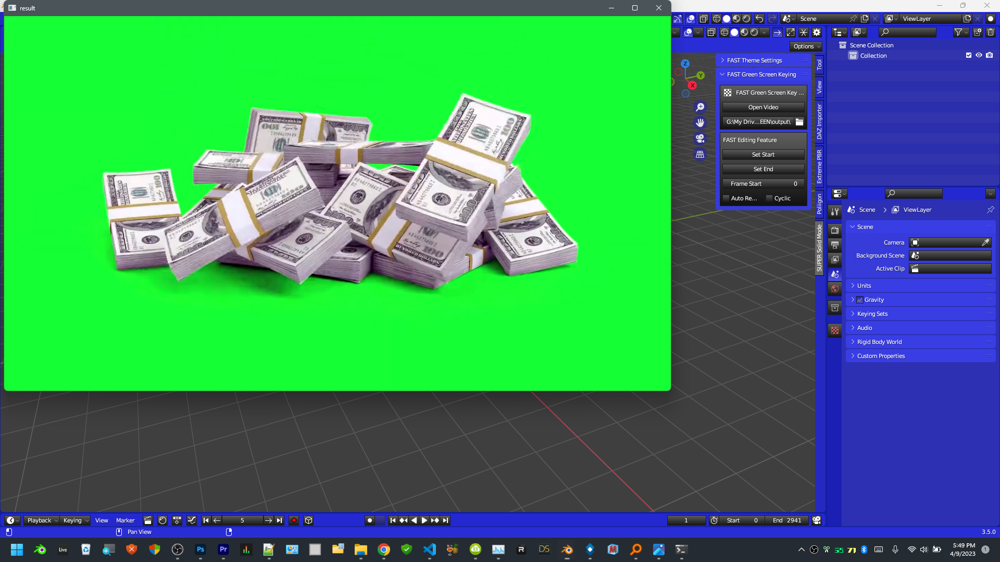
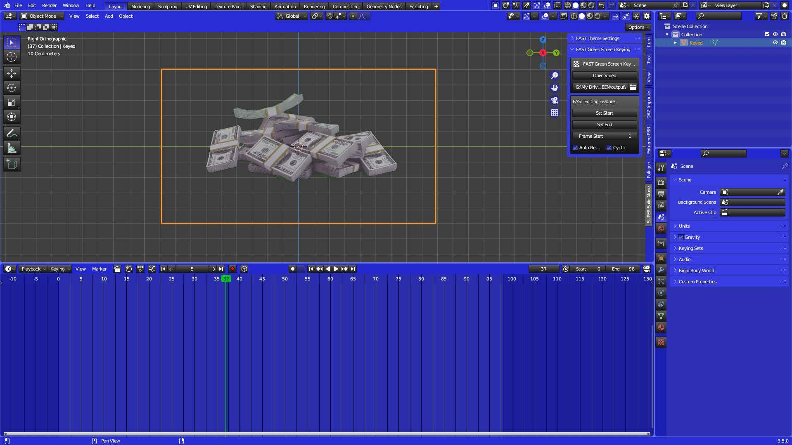
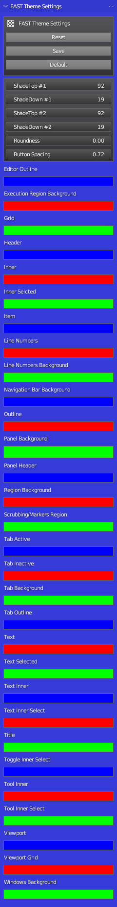

# FAST Green Screen Keying

Choose the Output Path...then click Open Video

This is what it will look like while the green screen background is being removed. Probably
best not to touch anything in Blender....don't even click the icon, just in case it might
freeze the process...(left)

When it's done you will have this the keyed out video on a plane similar to how the Blender
addon, Images as Planes, imports a video. (right)

THEN...use the Set Start and Set End buttons on the timeline on the SUPER SOLID
MODE! panel to cut the audio...already in the Sequencer... and the Frame Start slider to
move it on the timeline where you would like.
As this is using an Image Texture Node for the video on the plane, other Image Texture
Node options are also on the panel including, Auto Refresh and Cyclic (to loop your
video)
Note: Don't duplicate these clips!...it won't look good...That option is coming in a week. 

___
# The New FAST Theme Panel!

Changes multiple Blender Theme Properties at the same time!

* RESET BUTTON: Resets your Theme to Blender Dark

* SAVE BUTTON: Saves your edited Theme as 'FAST_Theme_user'

* DEFAULT BUTTON: Imports the default FAST Theme I created to inspire you

* Most of these properties on the FAST THEME PANEL sets multiple Blender theme properties at once allowing you to create an amazing Blender theme in no time at all.

* Some properties on the FAST THEME PANEL only change one Blender theme property but that's still better because now these properties are much easier to get to. With the combination we're able to change all the important colors for the Blender User Interface, as easily as I could figure out, while still making it look good, and giving you a lot of options.

* We just change the colors of the Blender User Interface here.

* Don't worry about important colors that you rely on like Vertex colors, Face Orientation colors or Weight Painting colors being changed, that won't happen.

* You can move sliders to your heart's content, and rest assured that when you get back to work on your project, you will know where everything is and what everything does.

* Try using the SHADE_TOP and SHADE_DOWN sliders after you have edited all your theme colors, to finish it off, and give it that nice polished to look. 

