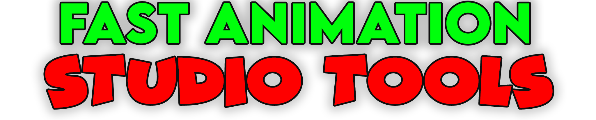

<!--  -->

# Welcome to the Super Solid Mode ! Documentation

**Super Solid Mode** is a Blender Add-on designed by a person who is making their own Sitcom in Blender, called "Toapy & Friends". 

So it is dedicated to fine tuning Blender so you can save as many button clicks as possible. It will suit the needs of all people dedicated to high production of video content in Blender.

## Versions

### SuperSolidMode 1.0 - Fast Green Screen Keying

* Import videos and control image sequences in VSE 
* ...

*Green screen keying in the addon*

!!! tip
    Read the [Getting Started](index.md#index) section, before browsing the rest of the documentation!  

# 

!!! note

    This project is under active development.

