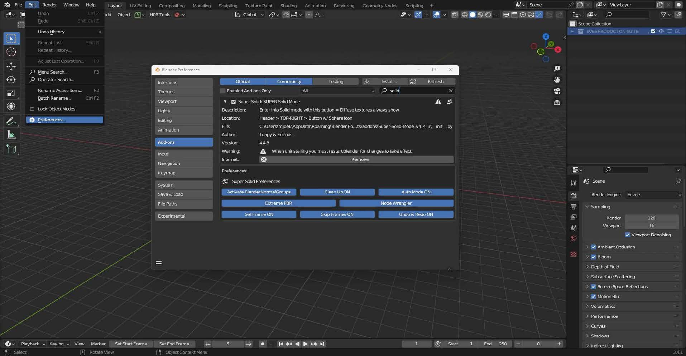
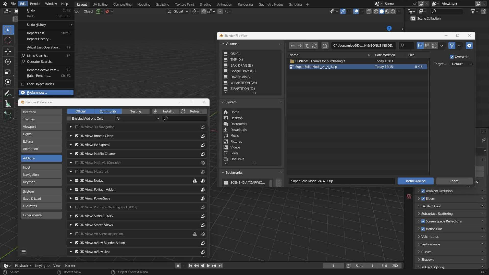

# Installation

## Installation instructions

___

### Step 1
To use the Super Solid Mode addon, first download the latest version from the Blender Market.
___
### Step 2
If you bought from GumRoad or Patreon then Unzip this file and go to the next
step...SUPER-SOLID-MODE_v*.*.*_ADD-ON & BONUS INSIDE if you bought from Blender
Market (you just have the bare Add-on, they wouldn't let me post my bonuses there!:-) just
go to step #4 (If you bought from Blender Market and would like the bonuses send a
message on Blender Market or to [bony-joe@toapyandfriends.com)](mailto:bony-joe@toapyandfriends.com) and I will send them,
they are real click-savers!)

!!! warning "Next step"
    If you have an older version of Super Solid Mode installed, go to **Step 3**. If not, go to **Step 4**.
___
### Step 3 
In Blender go to: "Edit" - "Preferences" - "Add-ons" - in the search type bar:
"super" search the add-on, and left click on "REMOVE". 
___
### Step 4
THIS STEP IS IMPORTANT: Restart Blender!!...whenever you remove an addon!

___

### INSTALLING THE ADD-ON:
In Blender ⇨ "Edit" ⇨ "Preferences..." ⇨ "Add-ons" ⇨ "Install" ⇨ In the pop-up windows search
for the "Super-Solid-Mode_v*_*_*" inside folder you unzipped ⇨ Click the "Install Add-on" button. 

**WELCOME TO A BETTER BLENDER!**

___

### INSTALLATION (THE BONUSES!!)
* IN APPS FOLDER - EVERYTHING APP (sorry only Windows Apps)
* Install Everything Windows app with default settings [https://www.voidtools.com/
downloads/](https://www.voidtools.com/
downloads/)

* Pin the shortcut it created to your taskbar, open it and type ".blend1"
* Everything will find all those pesky auto save files that are lurking everywhere on
your hard drive, your external hard drives and all partitions.
* Now in BLENDER! go to Edit/Preferences/Save & Load and crank up Save Versions as
high as you want and know you can easily delete all those extra files when your hard
drive gets full, else leave them there and feel secure your projects are safe. When my
drive gets full I move them all to an external hard drive that way I'm always safe.
THIS WORKS FOR EVERYTHING! if you give all your 3D assets a unique name,
you never have to search in Windows Explorer again, because, Windows Explorer
takes much longer than this does. Sorry, Windows, you are still the best OS hands
down IMHO.
___
### IN APPS FOLDER - CAPS UNLOCKER (sorry MAC USERS, only Windows Apps)

Users often forget to undo CAPS LOCK after using it, with the result that they later mistakenly
type a whole line of text in caps and have to re-type it. CapsUnlocker will help you with this: 
([http://www.itsamples.com/downloads/caps-unlocker.zip](http://www.itsamples.com/downloads/caps-unlocker.zip))

* Click CapsUnlocker.exe to start, 
* Click the triangle on right of Taskbar, that's the System Tray, 
* RightClick the CapsUnlocker icon, Click Options, Click the box Load at Windows Startup.

I didn't like forgetting to turn off CAPS LOCK, I'm sure you don't either, now that's over!
Sometimes the best improvements to BLENDER! are those done outside of BLENDER!
___
### IN BATCH FILES FOLDER - READ THE README (sorry MAC USERS, Windows Only)
Just start using these Batch Files to improve your workflow. You'll be glad you did.

**I'LL KEEP IMPROVING THE BONUSES, SO MAKE SURE YOU HAVE THE LATEST UPDATE, I WILL SAVE YOU BUTTON CLICKS!**