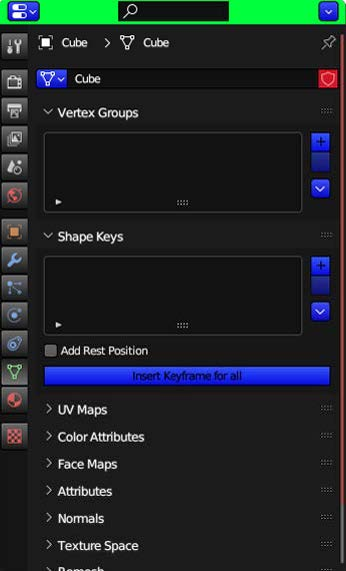
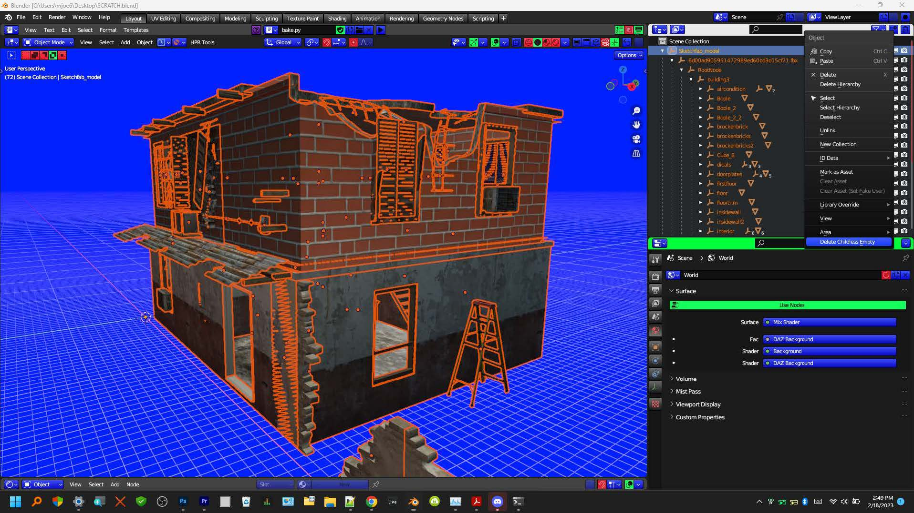

# Insert Keyframe for all Shapekeys

If you have multiple Shape Keys, and you set a keyframe
with this button, you're essentially setting a snapshot of how
your object looks at that given point on the timeline and
you'll know that's how it's going to look every time you bring
the playhead back to that position on the timeline. I feel
adding Shape Key keyframes one at a time leads to errors
and is not intuitive nor conducive to a fast workflow. 

