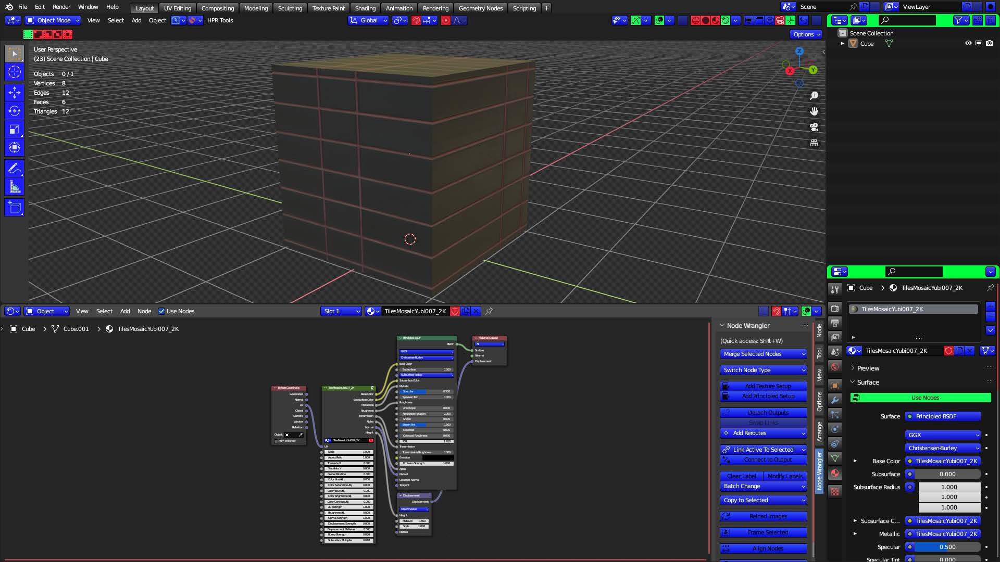
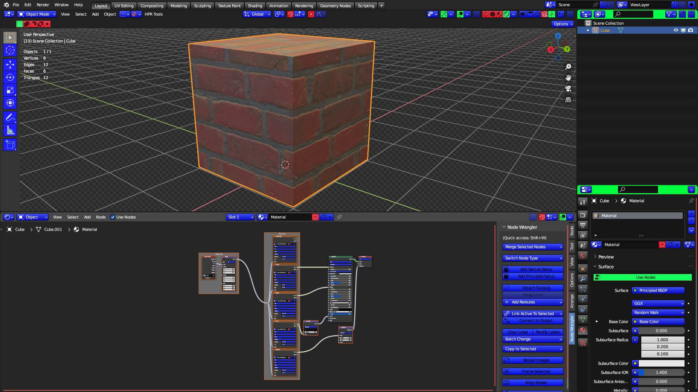
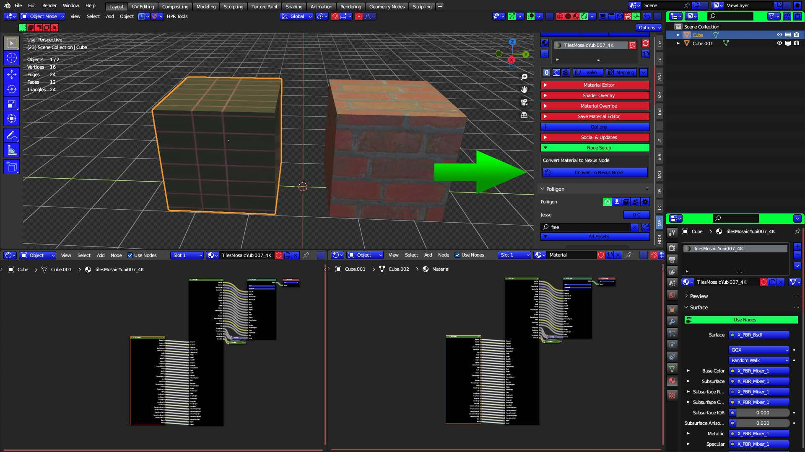
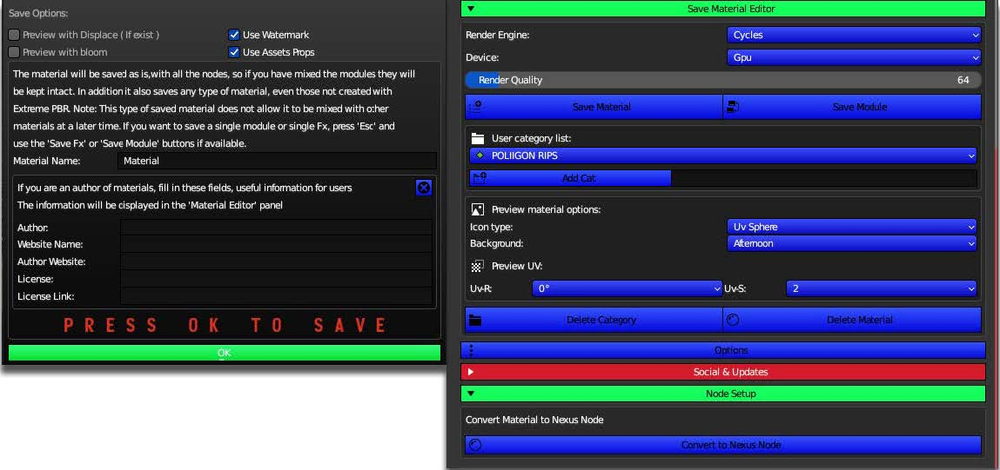
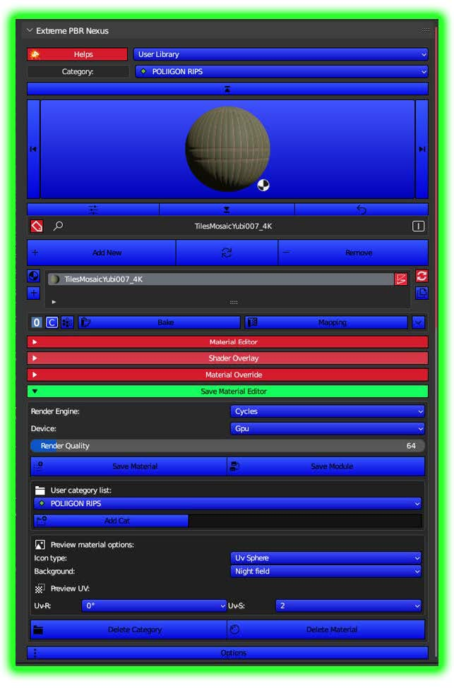

# ANY MATERIAL TO EXTREME PBR

Add ANY PBR Material into Extreme PBR User Library

NOW YOU CAN CONVERT ANY PBR MATERIAL ADDED WITH POLIIGON ADD-ON to...

OR YOU CAN CONVERT ANY PBR MATERIAL ADDED WITH
NODE WRANGLER to...

AN EXTREME PBR NEXUS NODE!
and then...

SAVE THAT TO YOUR EXTREME PBR USER
LIBARY and...

NOW IT'S IN YOUR USER LIBRARY
AND IT'S A NEXUS NODE, SO THERE
IS AN "EXTREME" AMOUNT OF WAYS
YOU CAN CUSTOMIZE IT!
now you...
NEVER HAVE TO TAKE UP YOUR
PRECIOUS SCREEN REAL ESTATE!!
to grab a...
PBR MATERIAL!!!
from the...
ASSET BROWSER!!!!
AGAIN!!!!!

