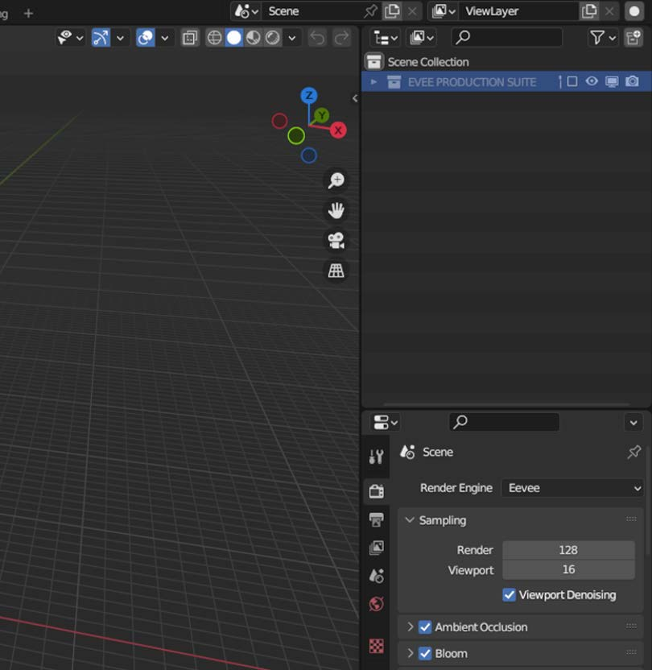

# The Super Solid Mode Button

One press, it does 3 things...
___

## 1. Makes solid mode look awesome

* It makes ***ALL*** objects show Diffuse image textures

*NOW SEE! With one click of the SUPER-SOLIDMODE Button the Default Cube is showing the Diffuse Map in the Solid mode viewport And the Diffuse map is selected in the Shader Editor.*

*SEE! The Default Cube is showing the Normal Map in the Solid mode viewport And the Normal map is selected in the Shader Editor, that's just how Blender works!*

Clicking the SUPER-SOLID-MODE! button shows the Diffuse Maps on all objects in your scene!

* ....This also works automatically:

|First Image|Second Image|
|:-:|:-:|
|||

*Auto Mode OFF* | *Auto Mode ON*
--- | ---
 | 

*Auto Mode OFF*

*Auto Mode ON*

**You can turn Auto Mode ON and Auto Mode OFF**

!!! tip "Auto Mode"
    Auto Mode activates the SUPER-SOLID-MODE! button when  you import any object (including Images as Planes) or add a material with the third party Extreme PBR add-on or add a material with the in-built Node Wrangler add-on. 

___

## 2. Faster Animation

* One-click of the SUPER-SOLID-MODE! button (or automatically)
optimizes all Normal Maps so you get BLAZING FAST ANIMATION on
objects with Armature modifiers + Shape Keys!

* With Auto Mode ON, all Normal Maps are optimized automatically, EVERY ANIMATION
THAT CAN BE SPED UP, WILL!

*Regular Normal Map*

*Optimized Normal Map*

**TABBING INTO THE OPTIMIZED NODE**

!!! info "Auto Mode"
    We use the Bump Node (that uses derivative functions on the GPU to calculate tangent space) to construct a tangent space matrix and then use that for the tangent space normal map calculation. Which, gave me real-time animation in EVEE Render mode on a 118,000 face character dancing in front of BIG mansion with almost 2 MILLION faces, YMMV. Note: Simplify in Render Properties was set at 0 subdivisions. 

Clicking the SUPER-SOLID-MODE! button also gives you...

___

## 3. Automatic Clean-up

Automatically or by clicking the SUPER-SOLID-MODE! button will run BLENDER! Clean up Functions, keeping your file as small as can be, by removing the junk that gets left behind when you delete things. This minimizes BLENDER! hanging. BLENDER! hangs when it's Auto Saving because of big file sizes.
